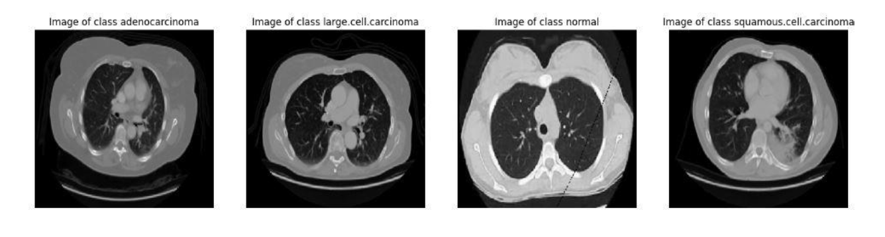
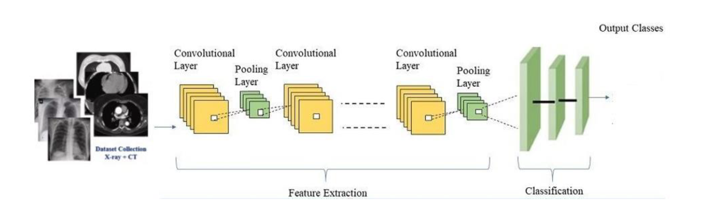
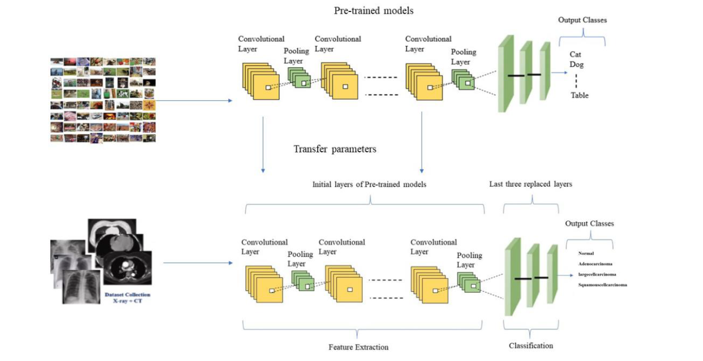

##  What You Will Learn in This Assignment

- How to design and implement a simple Convolutional Neural Network (CNN) for medical image classification, including convolution, pooling, feature extraction, and fully connected layers.

- How to use TensorBoard (or similar tools) for monitoring experiments and performing hyperparameter tuning by comparing metrics such as loss and accuracy across different runs.

- Understanding the impact of data augmentation techniques on model generalization, and how transformations such as flipping, rotation, cropping, and contrast adjustment can reduce overfitting and improve robustness to unseen data.

- How to ensure experiment reproducibility by setting random seeds for Python, NumPy, and PyTorch, and controlling deterministic behavior in CUDA operations.

- How to use transfer learning with pre-trained models by analyzing model architecture, applying the correct preprocessing, freezing feature extraction layers, and modifying classifier layers for a new task.

___

This is a selected dataset of chest cancer images. The dataset contains **4 classes**:

- normal  
- adenocarcinoma  
- large cell carcinoma  
- squamous cell carcinoma  

The images related to each class are placed inside separate folders. The code for downloading the dataset and converting the data format to NumPy is provided in the second cell of notebook.

### 1. Split the dataset into training and testing sets 

The model architecture should follow the structure shown below.

### 2. Apply data augmentation methods using relevant libraries. Apply the following methods in the specified order on the network input :

- Random resized crop with 20% probability  
- Vertical flip with 20% probability  
- Horizontal flip with 20% probability  
- Contrast adjustment with 20% probability  
- Rotation up to 30 degrees with 20% probability  

**Note:** Each of these methods must be applied randomly with a 20% probability to every image in the training dataset.

After training the model, plot accuracy and loss graphs and compare them with the case **before applying data augmentation**.

### 3. Use regularization methods and Dropout to prevent overfitting 

### 4. Tune hyperparameters using tools such as tesnsorboard or WandB and report the hyperparameter values  
(e.g., learning rate, batch size, number of filters, Dropout rate) based on the best result.  

### 5. Use a pre-trained model (similar to the figure below) for training and report loss and accuracy 

#### a)
In any framework you are working with, select one of the available pre-trained models.  
Use the `summary` function to review the architecture of the pre-trained model.  
With the help of preprocessing functions provided by the framework, apply the same preprocessing used for training the pre-trained model to your dataset to ensure good performance.

#### b)
Freeze the feature extraction layers and modify the classifier section according to the problem dataset. 

#### c)
Train the resulting model on the training dataset and finally evaluate its performance on the test dataset. Report accuracy and loss. 

